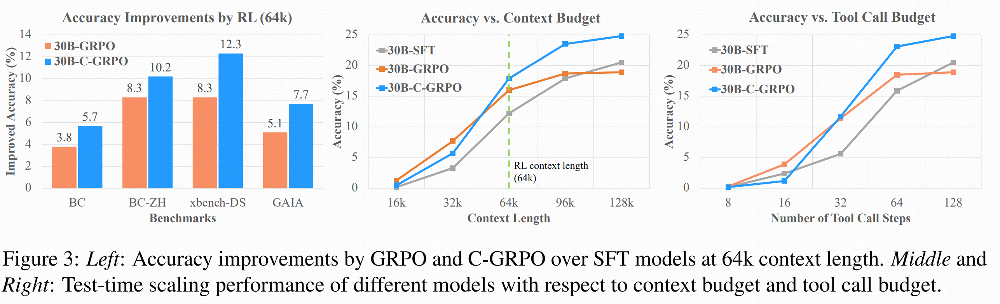
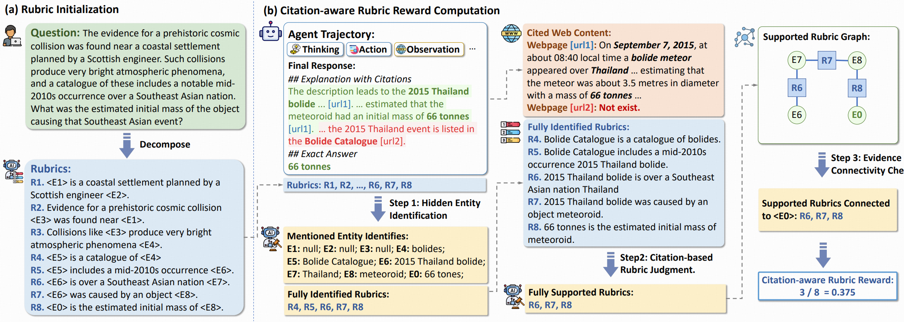
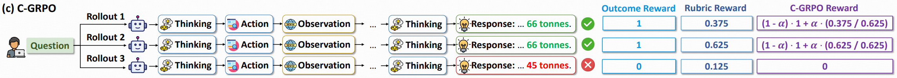
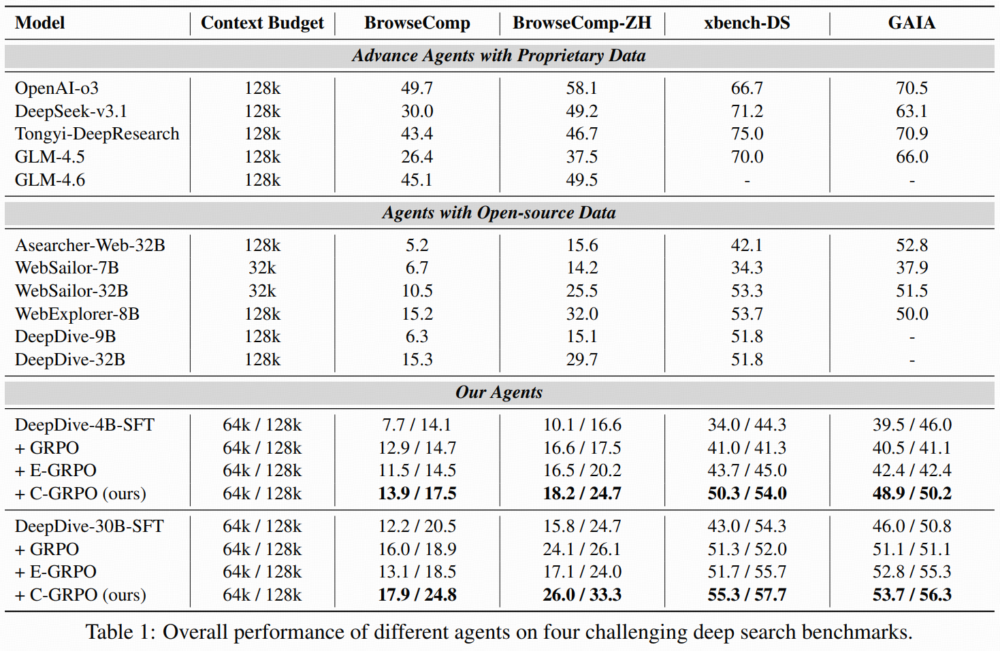
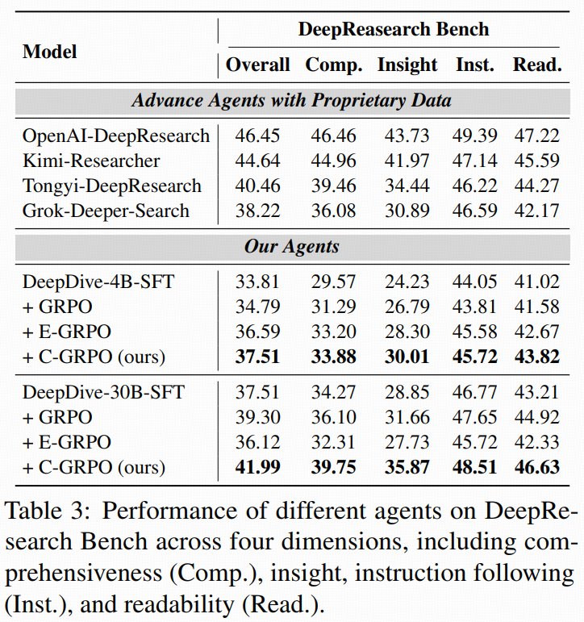

# Chaining the Evidence: Robust Reinforcement Learning for Deep Search Agents with Citation-Aware Rubric Rewards

<div align="center">

[](https://github.com/THUDM/CaRR)
[](https://arxiv.org/pdf/xxxx.xxxxx)
[](https://huggingface.co/datasets/THU-KEG/CaRR-DeepDive)

</div>

<div align="center">
  
  <p><em> </em></p>
</div>

## 🔥 News

- **[2026/01/11]** Our **SFT trajectories** and **RL QA pairs with rubrics** have been fully open-sourced on [Hugging Face Dataset CaRR-DeepDive](https://huggingface.co/datasets/THU-KEG/CaRR-DeepDive).
- **[2026/01/11]** Released the **CaRR** framework, implemented as a remote reward model server — now fully available in [`./deepsearch_rm_with_rubrics`](https://github.com/THUDM/CaRR/tree/main/deepsearch_rm_with_rubrics).
- Model and training code are currently being organized – coming soon!

## 🚀 Overview

Existing Reinforcement Learning (RL) approaches for deep search agents primarily rely on **binary outcome rewards** (i.e., whether the final answer is correct). However, pure outcome rewards fail to capture the comprehensiveness and factuality of agents’ reasoning process, often leading to undesirable behaviors such as:

- **Shortcut exploitation**: Agents may find the answer using only partial information, ignoring complex constraints.

- **Hallucinations**: Agents may arrive at the correct answer via fortunate huallucinations.

Optimizing toward these flawed trajectories will result in agents with diminished robustness and suboptimal performance

To address these, we propose **Citation-aware Rubric Rewards (CaRR)** and **Citation-aware Group Relative Policy Optimization (C-GRPO)** to encourage deep search agents to conduct comprehensive, evidence-grounded reasoning.


---

## ✨ Key Features

### 1. Citation-Aware Rubric Rewards (CaRR)

<div align="center">

<p><em></em></p>
</div>

CaRR is a fine-grained reward framework for deep search agents that emphasizes reasoning comprehensiveness, factual grounding, and evidence connectivity. It decomposes complex, multi-hop questions into atomic, verifiable **rubrics**. A trajectory satisfies a rubric only if:

- **Entity Identification:** It explicitly identifies all hidden entities involved.


- **Citation Grounding:** The statement is fully supported by the cited web contents.


- **Evidence Connectivity:** The supported rubrics forms an evidence chain that connects to the final predicted answer.


### 2. Citation-aware Group Relative Policy Optimization (C-GRPO)

<div align="center">

<p><em></em></p>
</div>


C-GRPO extends Group Relative Policy Optimization (GRPO) by assigning an additional weighted citation-aware rubric reward to trajectories that have found the correct final answer. This encourages the model to improve accuracy and reasoning quality simultaneous, thereby promoting more robust policy learning.

---

## 📊 Experimental Results

Our RL experiments use [Qwen3-4B-Thinking-2507](https://huggingface.co/Qwen/Qwen3-4B-Thinking-2507) and [Qwen3-30B-A3B-Thinking-2507](https://huggingface.co/Qwen/Qwen3-30B-A3B-Thinking-2507) as backbone models, and use [DeepDive](https://github.com/THUDM/DeepDive) as the training data. 

Evaluation results on four challenging deep search benchmarks show that C-GRPO consistently outperforms standard outcome-based GRPO, and demonstrates superior test-time scaling capacity, effectively utilizing longer context budgets to improve performance:

<div align="center">

<p><em></em></p>
</div>

C-GRPO agents also generalize well to open-ended deep research tasks:

<div align="center">

<p><em></em></p>
</div>

---

## Acknowledgments

- Built on top of [Qwen3-4B-Thinking-2507](https://huggingface.co/Qwen/Qwen3-4B-Thinking-2507) and [Qwen3-30B-A3B-Thinking-2507](https://huggingface.co/Qwen/Qwen3-30B-A3B-Thinking-2507) base models
- Uses [DeepDive](https://github.com/THUDM/DeepDive) as the training datsets.
- Uses [Slime](https://github.com/THUDM/slime/) framework for RL training
- Powered by [Serper](https://serper.dev/) and [Jina](https://jina.ai/) APIs for web access

---

## 📖 Citation

If you find our work useful, please consider citing:

```bibtex
@misc{lu2025deepdiveadvancingdeepsearch,
      title={Chaining the Evidence: Robust Reinforcement Learning for Deep Search Agents with Citation-Aware Rubric Rewards},
      author={Jiajie Zhang and Xin Lv and Ling Feng and Lei Hou and Juanzi Li},
      year={2025},
      eprint={xxxx.xxxxx},
      archivePrefix={arXiv},
      primaryClass={cs.CL},
      url={https://arxiv.org/abs/xxxx.xxxxx},
}
```

