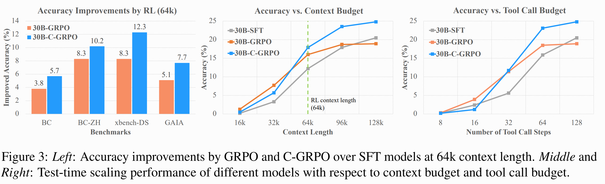
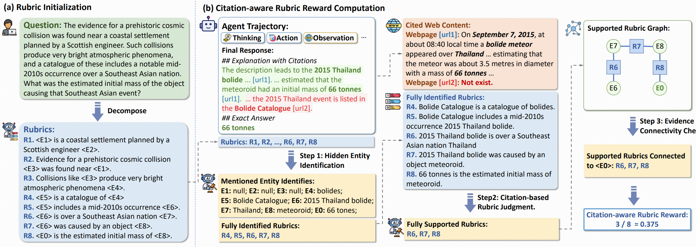
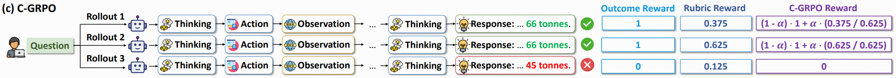
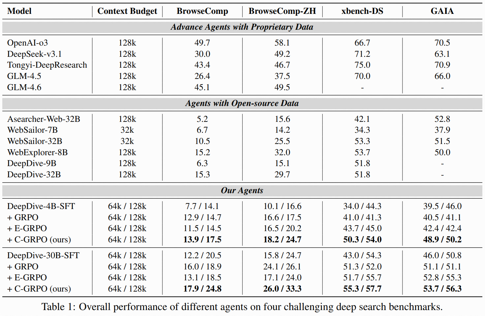
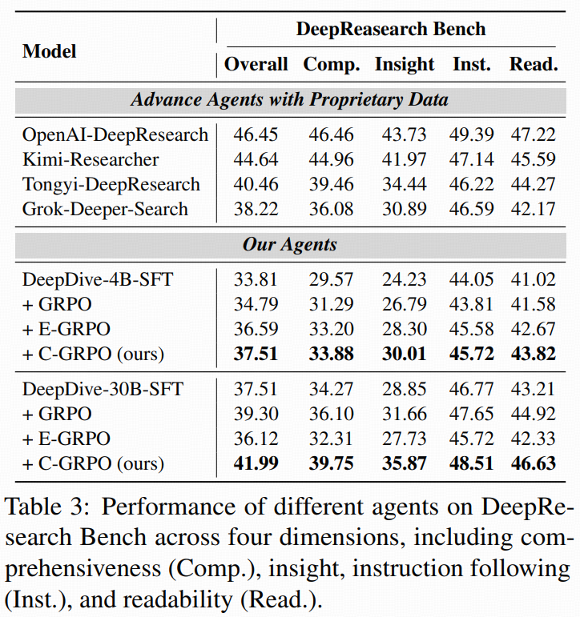

# [ACL 2026] Chaining the Evidence: Robust Reinforcement Learning for Deep Search Agents with Citation-Aware Rubric Rewards

<div align="center">

[](https://github.com/THUDM/CaRR)
[](https://arxiv.org/pdf/2601.06021)
[](https://huggingface.co/collections/THU-KEG/carr-and-c-grpo)

</div>

<div align="center">
  
  <p><em> </em></p>
</div>

## 🔥 News

- **[2026/04/08]** Our paper has been accepted by **ACL 2026**!

- **[2026/03/14]** Our **RL training and evaluation code** have been fully open-sourced.

- **[2026/03/12]** Our **SFT models** and **C-GRPO models** have been fully open-sourced on [Hugging Face](https://huggingface.co/datasets/THU-KEG/CaRR-DeepDive).

- **[2026/01/11]** Our **SFT trajectories** and **RL QA pairs with rubrics** have been fully open-sourced on [Hugging Face](https://huggingface.co/collections/THU-KEG/carr-and-c-grpo).
- **[2026/01/11]** Released the **CaRR** framework, implemented as a remote reward model server — now fully available in [`./deepsearch_rm_with_rubrics`](https://github.com/THUDM/CaRR/tree/main/deepsearch_rm_with_rubrics).
- Model and training code are currently being organized – coming soon!

## 🚀 Overview

Existing Reinforcement Learning (RL) approaches for deep search agents primarily rely on **binary outcome rewards** (i.e., whether the final answer is correct). However, pure outcome rewards fail to capture the comprehensiveness and factuality of agents’ reasoning process, often leading to undesirable behaviors such as:

- **Shortcut exploitation**: Agents may find the answer using only partial information, ignoring complex constraints.

- **Hallucinations**: Agents may arrive at the correct answer via fortunate huallucinations.

Optimizing toward these flawed trajectories will result in agents with diminished robustness and suboptimal performance

To address these, we propose **Citation-aware Rubric Rewards (CaRR)** and **Citation-aware Group Relative Policy Optimization (C-GRPO)** to encourage deep search agents to conduct comprehensive, evidence-grounded reasoning.


---

## ✨ Key Features

### 1. Citation-Aware Rubric Rewards (CaRR)

<div align="center">

<p><em></em></p>
</div>

CaRR is a fine-grained reward framework for deep search agents that emphasizes reasoning comprehensiveness, factual grounding, and evidence connectivity. It decomposes complex, multi-hop questions into atomic, verifiable **rubrics**. A trajectory satisfies a rubric only if:

- **Entity Identification:** It explicitly identifies all hidden entities involved.


- **Citation Grounding:** The statement is fully supported by the cited web contents.


- **Evidence Connectivity:** The supported rubrics forms an evidence chain that connects to the final predicted answer.


### 2. Citation-aware Group Relative Policy Optimization (C-GRPO)

<div align="center">

<p><em></em></p>
</div>


C-GRPO extends Group Relative Policy Optimization (GRPO) by assigning an additional weighted citation-aware rubric reward to trajectories that have found the correct final answer. This encourages the model to improve accuracy and reasoning quality simultaneous, thereby promoting more robust policy learning.

---

## 📊 Experimental Results

Our RL experiments use [Qwen3-4B-Thinking-2507](https://huggingface.co/Qwen/Qwen3-4B-Thinking-2507) and [Qwen3-30B-A3B-Thinking-2507](https://huggingface.co/Qwen/Qwen3-30B-A3B-Thinking-2507) as backbone models, and use [DeepDive](https://github.com/THUDM/DeepDive) as the training data. 

Evaluation results on four challenging deep search benchmarks show that C-GRPO consistently outperforms standard outcome-based GRPO, and demonstrates superior test-time scaling capacity, effectively utilizing longer context budgets to improve performance:

<div align="center">

<p><em></em></p>
</div>

C-GRPO agents also generalize well to open-ended deep research tasks:

<div align="center">

<p><em></em></p>
</div>

## Environment Preparation

### Step 0) Pull Slime Docker image

Recommended image (from `slime/docker/version.txt`):

```bash
docker pull slimerl/slime:nightly-dev-20260311a
```

### Step 1) Generate and fill environment variables

```bash
bash scripts/setup/prepare_env.sh
```

Edit `.env` and fill at least the following fields:

- Workspace paths: `CARR_ROOT`, `SLIME_ROOT`
- Tool Server: `SERP_API_KEY`, `JINA_API_KEY`, `TOOL_SERVER_PORT`
- Training RM: `DEEPSEEK_API_KEY`, `DEEPSEEK_BASE_URL`, `RM_TRAIN_PORT`
- Evaluation RM: `OPENAI_API_KEY`, `OPENAI_BASE_URL`, `RM_EVAL_PORT`
- Data encryption/decryption: `EVAL_DATA_PASSWORD`
- Optional proxy: `HTTP_PROXY`, `HTTPS_PROXY`

### Step 2) Start Tool Server

```bash
bash scripts/setup/start_tool_server.sh
```

Script configuration:

- Reads: `SERP_API_KEY`, `JINA_API_KEY`, `TOOL_SERVER_PORT`
- Optional: `HTTP_PROXY` (automatically applied when non-empty)
- Working directory: `${CARR_ROOT}/tool_server`

Recommended health check after startup:

```bash
curl -sS http://127.0.0.1:${TOOL_SERVER_PORT:-7230}/ \
  -X POST \
  -H 'Content-Type: application/json' \
  -d '{"session_id":"health","name":"start_session","arguments":{},"remote_env_info":null}'
```

### Step 3) Start training RM server (deepseek-chat)

```bash
bash scripts/setup/start_rm_deepseek.sh
```

Script configuration:

- Reads: `RM_TRAIN_PORT`, `DEEPSEEK_BASE_URL`, `DEEPSEEK_API_KEY`
- Model: `deepseek-chat`
- Working directory: `${CARR_ROOT}/deepsearch_rm_with_rubrics`

### Step 4) Start evaluation RM server (gpt-5-chat)

```bash
bash scripts/setup/evaluation_start_rm_gpt5.sh
```

Script configuration:

- Reads: `RM_EVAL_PORT`, `OPENAI_BASE_URL`, `OPENAI_API_KEY`
- Model: `gpt-5-chat-2025-08-07`
- Working directory: `${CARR_ROOT}/deepsearch_rm_with_rubrics`

### Step 5) Prepare and decrypt evaluation datasets

Dataset locations:

- Encrypted files: `data/eval/*.jsonl.enc`
- Decrypted files: `data/eval_decrypted/*.jsonl`

Before training or evaluation, decrypt datasets:

```bash
bash scripts/setup/decrypt_eval_data.sh
```

Script configuration:

- `decrypt_eval_data.sh`: reads `EVAL_DATA_PASSWORD`, decrypts `data/eval/*.enc` into `data/eval_decrypted/*.jsonl`

## Training

### Step 1) Convert 4B checkpoint (HF -> torch_dist)

```bash
bash scripts/setup/convert_4b.sh
```

Script configuration:

- Reads: `SLIME_ROOT` (defaults to `${CARR_ROOT}/slime` if unset)
- Runs conversion command directly in `slime/tools/convert_hf_to_torch_dist.py`

### Step 2) Convert 30B checkpoint (HF -> torch_dist)

```bash
bash scripts/setup/convert_30b.sh
```

Script configuration:

- Reads: `SLIME_ROOT`
- Runs conversion command directly in `slime/tools/convert_hf_to_torch_dist.py`

### Step 3) Launch 4B training

```bash
bash scripts/training/training_run_4b-C-GRPO-rubric0.3.sh
```

Script configuration:

- Reads: `SLIME_ROOT`
- Run `bash scripts/setup/decrypt_eval_data.sh` once before training/evaluation
- Evaluation data source during training: `data/eval_decrypted/` (filenames without `-browser-oss`)

### Step 4) Launch 30B training

```bash
bash scripts/training/training_run_30b-C-GRPO-rubric0.3.sh
```

Script configuration:

- Reads: `SLIME_ROOT`
- Run `bash scripts/setup/decrypt_eval_data.sh` once before training/evaluation
- Evaluation data source during training: `data/eval_decrypted/` (filenames without `-browser-oss`)

## Evaluation

### Step 1) Run 4B evaluation

```bash
bash scripts/eval/evaluation_run_4b.sh
```

Script configuration:

- Reads: `SLIME_ROOT`
- Reads `data/eval_decrypted/*.jsonl` (decrypt once in setup stage)

### Step 2) Run 30B evaluation

```bash
bash scripts/eval/evaluation_run_30b.sh
```

Script configuration:

- Reads: `SLIME_ROOT`
- Reads `data/eval_decrypted/*.jsonl` (decrypt once in setup stage)

### Recommended execution order

1. `prepare_env.sh`
2. `start_tool_server.sh`
3. `start_rm_deepseek.sh`
4. `evaluation_start_rm_gpt5.sh`
5. `decrypt_eval_data.sh` (in `scripts/setup/`)
6. `convert_4b.sh` (in `scripts/setup/`)
7. `convert_30b.sh` (in `scripts/setup/`)
8. `training_run_4b-C-GRPO-rubric0.3.sh` / `training_run_30b-C-GRPO-rubric0.3.sh`
9. `evaluation_run_4b.sh` / `evaluation_run_30b.sh`

---

## Acknowledgments

- Built on top of [Qwen3-4B-Thinking-2507](https://huggingface.co/Qwen/Qwen3-4B-Thinking-2507) and [Qwen3-30B-A3B-Thinking-2507](https://huggingface.co/Qwen/Qwen3-30B-A3B-Thinking-2507) base models
- Uses [DeepDive](https://github.com/THUDM/DeepDive) as the training datsets.
- Uses [Slime](https://github.com/THUDM/slime/) framework for RL training
- Powered by [Serper](https://serper.dev/) and [Jina](https://jina.ai/) APIs for web access

---

## 📖 Citation

If you find our work useful, please consider citing:

```bibtex
@misc{lu2025deepdiveadvancingdeepsearch,
      title={Chaining the Evidence: Robust Reinforcement Learning for Deep Search Agents with Citation-Aware Rubric Rewards},
      author={Jiajie Zhang and Xin Lv and Ling Feng and Lei Hou and Juanzi Li},
      year={2025},
      eprint={2601.06021},
      archivePrefix={arXiv},
      primaryClass={cs.CL},
      url={https://arxiv.org/abs/2601.06021},
}
```

